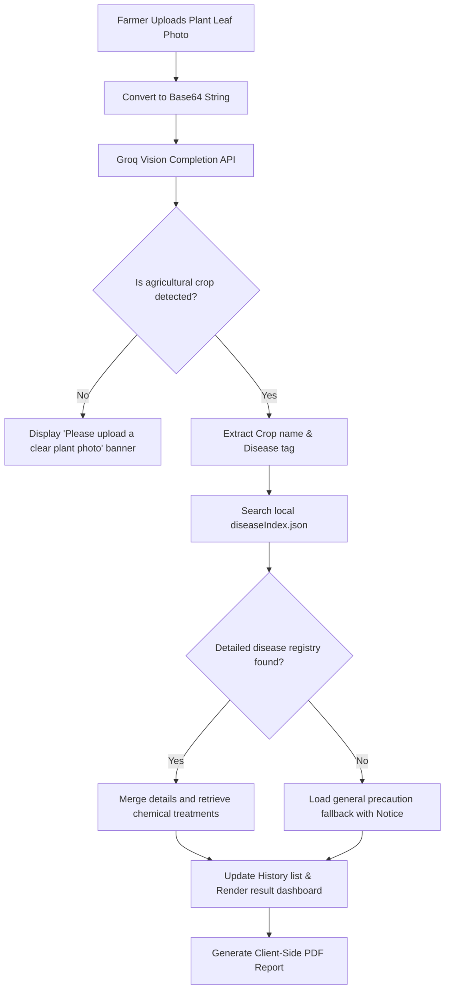
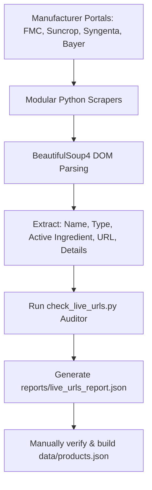

# CropMedic AI 🌿

CropMedic AI is a professional, production-ready agricultural intelligence assistant designed to enable offline-first plant disease diagnostics, preventative care plans, and officially registered chemical treatment listings. 

Developed by **Muhammad Abdullah Khan** (mabdullahkhan.tech@gmail.com), this project bridges advanced machine learning vision diagnostics with robust local data registries, offering farmers and crop advisors instant guidance without relying entirely on active internet connections.

---

## 🚀 Key Features

* **Strict AI Vision Diagnostics**: Powered by the `meta-llama/llama-4-scout-17b-16e-instruct` vision model via Groq's high-speed completions API, returning strict JSON structured schemas.
* **Non-Crop & Irrelevant Image Filtering**: Built-in safety heuristics prompt the vision pipeline to validate the image type first. If non-plant content is uploaded, the app raises a clear warning and halts api-overhead.
* **Offline-First Local Knowledge Base**: Consolidates matches from the AI model with a local index (`diseaseIndex.json` and `products.json`) to return registered pesticide, fungicide, and herbicide solutions.
* **Modular Developer Scraper Pipeline**: Python BeautifulSoup-based scraper modules target official agriculture company listings in Pakistan (FMC, Suncrop, Syngenta, Bayer) to feed the offline database.
* **Link Audit Utility**: Includes a custom requests-based URL verification utility (`check_live_urls.py`) with session headers, retry rules, and status reports to catch broken product details links.
* **Local Session History**: Persists the last 10 scans to the client browser's `localStorage` (excluding base64 image payloads to preserve storage quota) for immediate load/retrieval.
* **Interactive Confirmations**: Replaces generic browser popups with premium custom React inline confirmation dialogues to preserve context and ensure smooth automated browser testing.
* **Premium Client-Side PDFs**: Generates structured, multi-page PDF diagnosis reports with custom corporate color styling, clear sections, active hyperlinked recommendations, and legal disclaimers.
* **Fully Responsive Light/Dark Modes**: Clean HSL-defined UI system with custom glassmorphism components styled using Tailwind CSS (v4) and vanilla CSS.

---

## 🔄 Workflows & Architecture

### 1. Unified Diagnostic Pipeline
This flow illustrates how an uploaded leaf image is analyzed, filtered, matched against the local SQLite-equivalent JSON store, and delivered as a PDF report:



### 2. Developer Data Collection Pipeline
How scrapers harvest registrations and match active ingredients for crop protection:



---

## 📂 Project Structure

```text
├── data/
│   ├── diseaseIndex.json      # Offline crop-disease diagnostics database
│   └── products.json          # Scraped agricultural products catalog
├── reports/
│   └── live_urls_report.json  # Link audit outputs from url check utility
├── scripts/
│   ├── baseScraper.py         # Modular base class for crawlers
│   ├── bayerScraper.py        # Bayer CropScience crawler
│   ├── fmcScraper.py          # FMC Corporation crawler
│   ├── suncropScraper.py      # Suncrop Group crawler
│   ├── syngentaScraper.py     # Syngenta Pakistan crawler
│   ├── check_live_urls.py     # Link checker audit tool
│   └── updateDatabase.py      # Orchestrates scraping output to data/
├── src/
│   ├── components/
│   │   ├── About.jsx          # Project mission & creator details
│   │   ├── AnalysisResult.jsx # Full diagnostic result & action panel
│   │   ├── Contact.jsx        # Developer contact forms & socials
│   │   ├── Features.jsx       # Value propositions grid
│   │   ├── Footer.jsx         # Copyright & quick links
│   │   ├── HistoryList.jsx    # Offline-saved scans manager
│   │   ├── Navbar.jsx         # Responsive main menu & theme triggers
│   │   ├── SettingsModal.jsx  # Dark/light theme & local storage controls
│   │   └── UploadCard.jsx     # File drag-and-drop & processing status
│   ├── pages/
│   │   └── Home.jsx           # Main orchestrator for diagnostics
│   ├── services/
│   │   ├── aiService.js       # Groq OpenAI-compatible API interface
│   │   └── knowledgeService.js# Search module linking AI outputs to data/
│   ├── utils/
│   │   └── pdfGenerator.js    # Client-side multi-page PDF builder
│   ├── App.jsx                # Global routes and theme configuration
│   └── main.jsx               # Entry script
├── index.html                 # HTML template with SEO tags
├── package.json               # Frontend dependencies
├── vite.config.js             # Vite configuration
└── .gitignore                 # Excluded directories (modules, build, pycache)
```

---

## ⚙️ Installation & Setup

### Prerequisites
* **Node.js**: v18.0.0 or higher
* **Python**: v3.11.0 or higher (required for crawling scripts)
* **Groq API Key**: Obtain a key from the [Groq Console](https://console.groq.com/keys).

### 1. Setup the Web Client
Clone the repository, install npm packages, configure environment settings, and boot the hot-reloading development server:

```bash
# Clone the repository
git clone https://github.com/Abdullah01607/CropMedic-AI.git
cd CropMedic-AI

# Install dependencies
npm install

# Setup environment variables
# Copy .env.example into .env and edit with your actual key
cp .env.example .env

# Run the development environment
npm run dev
```

### 2. Setup Crawlers & Audit Tools (Developer-only)
The scraper modules rely on standard Python libraries. Install requests and beautifulsoup4:

```bash
# Install python packages
pip install requests beautifulsoup4

# Audit current URLs in products database
python scripts/check_live_urls.py

# Run targeted manufacturer scrapers
python scripts/fmcScraper.py
python scripts/suncropScraper.py
```

---

## 🛡️ Limitations & Future Improvements
1. **Manufacturer Antispam blocks (403)**: Major company sites (Bayer, Syngenta) currently protect their sites using bot-detection. Future updates can leverage stealth-playwright configurations or rotate user-agent pools to bypass these barriers.
2. **Offline Expansion**: Broadening the local database mappings in `diseaseIndex.json` to cover sub-varieties of crops and regional biological treatments.
3. **PWA Integration**: Upgrading the React container to a Progressive Web App (PWA) to allow complete asset-caching for fieldwork without internet access.

---

## 👨‍💻 Project Creator & Lead Developer
* **Name**: Muhammad Abdullah Khan
* **Email**: mabdullahkhan.tech@gmail.com
* **GitHub**: [Abdullah01607](https://github.com/Abdullah01607)
* **LinkedIn**: [Muhammad Abdullah Khan](https://linkedin.com/in/abdullah-khan)

---

## ⚖️ Legal Disclaimer
CropMedic AI is an educational diagnostic helper. All chemical recommendations and prevention strategies are compiled from public index resources. Farmers must consult qualified agronomists and read official manufacturer product labels before applying crop chemicals.
